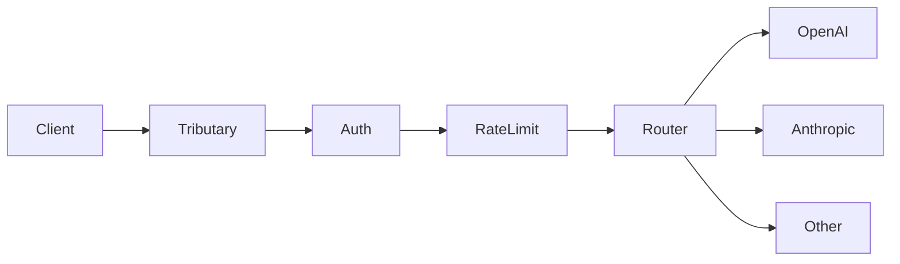
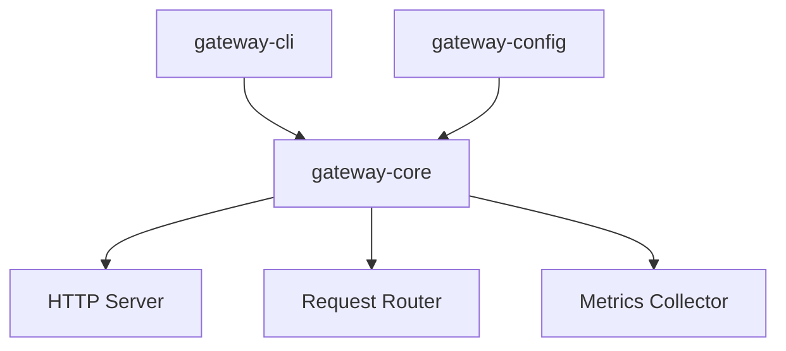

## Request flow

1. **Client** sends an OpenAI-compatible request
2. **Auth** validates API keys and permissions
3. **Rate Limit** enforces per-key or global limits
4. **Router** selects the provider based on route config
5. **Provider** handles the request; response streams back through Tributary

## Design principles

- **Zero-copy proxying** — request bodies stream through without buffering
- **No Python dependency** — pure Rust, minimal binary size
- **OpenAI-compatible** — existing SDK integrations work unchanged
- **Hot-reload config** — change routes without restarting

## Components

- **gateway-cli** — CLI entry point and config loading
- **gateway-core** — HTTP server, routing, middleware
- **gateway-config** — YAML config parsing and hot-reload
